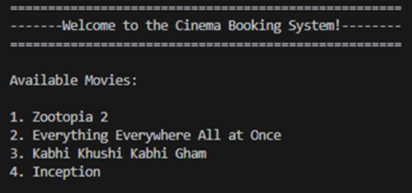
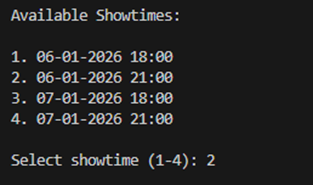
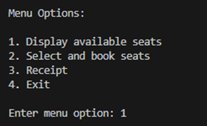
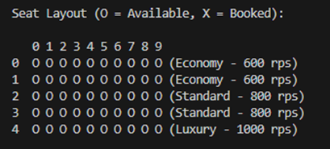
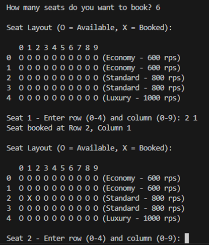
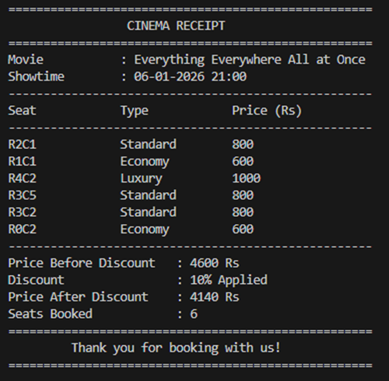

**Cinema Booking System — Semester 1 Final ITP Project**

Overview
- A simple console-based Cinema Booking System written in C++ for an introductory ITP course final project. The program lets users view movies and showtimes, select seats, and save booking information to disk.

Table of contents
- Overview
- Requirements
- Build
- Run
- Usage
- Screenshots (where to add them)
- Project structure
- Contributing
- License & Contact

Requirements
- A C++ compiler that supports C++17 (g++, clang, or MSVC).
- Minimal disk space to store booking output in the `output/` folder.

Build
- Using `g++` (MinGW/MSYS2/WSL):

```bash
g++ -std=c++17 -O2 -o cinema main.cpp
```

- Using MSVC (Developer Command Prompt):

```powershell
cl /EHsc main.cpp
```

Run
- On Windows (when built with `g++`):

```powershell
.\cinema.exe
```

- On Linux/macOS/WSL:

```bash
./cinema
```

Usage
- After running the binary, follow the on-screen menu prompts to:
	- View currently available movies and showtimes
	- Select a showtime and seats
	- Confirm and save a booking (output files written to `output/`)

Project structure
- [main.cpp](main.cpp) — program source (single-file console app).
- [README.md](README.md) — this file.
- `output/` — folder the program writes booking data into at runtime.

Contributing
- This is a student project. If you want to make improvements, consider:
	- Refactoring into multiple source files (separate UI, data, and persistence)
	- Adding unit tests
	- Adding input validation and error handling

Screenshot headings:

- **Welcome / Movies display**

	

- **Showtime selection screen**

	

- **Menu Display**

	

- **Seat Layout showing available seats**

	

- **Booking confirmation messages**

	

- **Receipt generation**

	


License & Contact
- 
